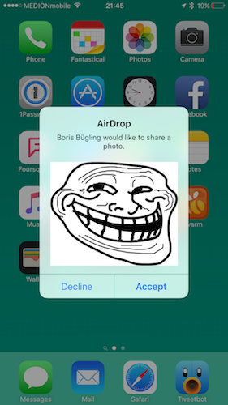

# trolldrop


AirDrop trollfaces to everyone. :trollface:



<blockquote class="twitter-tweet" data-lang="en"><p lang="en" dir="ltr">Sitting in a cafe, air dropping trollfaces to random people. That’s how I spent my Saturdays.</p>&mdash; NeoGazpatchOS (@NeoNacho) <a href="https://twitter.com/NeoNacho/status/726418879384276993">April 30, 2016</a></blockquote>

## Usage

Just run `trolldrop` and it will start airdropping continuously. There is an optional argument for specifiying the interval in seconds, it defaults to every 15 seconds.

```bash
$ ./trolldrop 2
💻 Alexsander Akers - 👨 iPhone
👹 🔜 Alexsander Akers
```

Note: tested on OS X 10.11.1, may not work on other versions because it uses private API.

## Installation

The easiest way is installation via homebrew:

```bash
$ brew install neonichu/formulae/trolldrop
```

You can also clone the repo and build it from source, of course.

## Thanks

Thanks to [a2](https://twitter.com/a2) for unlocking his phone all the time to let me test this, because AirDrop didn't work on my phone (not due to this tool :joy:). Thanks to the movie [🦀](http://www.imdb.com/title/tt3464902/) for keeping me entertained while making this.
